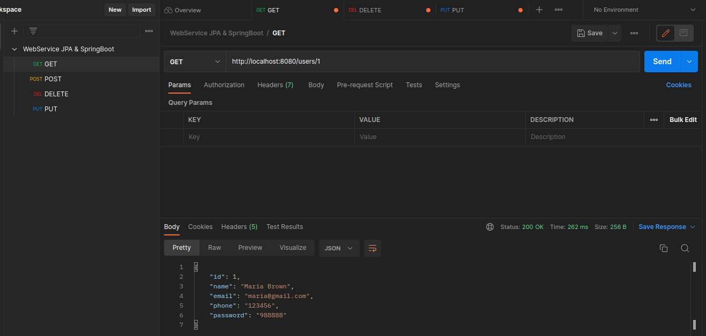

# Web services API Rest

## Modelo de domínio


> Trata-se de um projeto Web services com Spring Boot com intuito de simular compras online!

## Diagrama de objetos


### Pré-requisitos

Antes de começar, verifique se você atendeu aos seguintes requisitos:

* Você precisa compreender a linguagem Java, conceitos de POO (Encapsulamento, herança e polimorfismo)
* Você precisa compreender alguns projetos do ecossistema Spring
* Você precisa compreender o que é API Rest

### Tecnologias empregadas
- [x] Spring boot
- [x] Spring web
- [x] Spring JPA/Hibernate
- [x] Object Relational Mapping (ORM)
- [x] API Rest
- [x] Banco de dados H2

## Estrutura [Banco de Dados H2](https://en.wikipedia.org/wiki/H2_(DBMS))

Banco de dados totalmente contruído com ORM

<center> 
    <b>Banco de dados em memória</b>
</center>
<br>

### Imagens APIs Rest no [Postman](https://en.wikipedia.org/wiki/Postman_(software))
#### Post


#### Get


#### Put


#### Delete


Para instalar o projeto, siga estas etapas:

Linux, macOS e Windows:
```
<git clone git@github.com:CHARLLYS97/workshop-springboot3-jpa.git >
```
#### Próximo passo
* Importe o projeto na IDE _**Spring Tools Suite**_, e execute a classe 
``
CourseApplication.java
`` dentro da pasta `src/main/java/com/educandoweb` | [Acessar pasta](src/main/java/com/).
